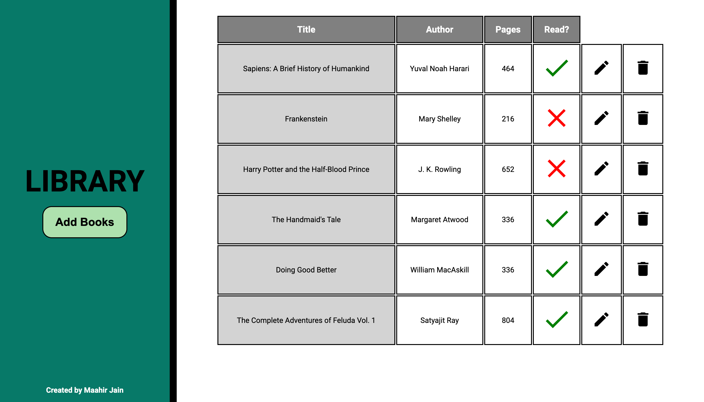

# Library

An online library to create reading lists and mark books that have been read, with local storage.

## [Live Preview](https://maahirjain.github.io/library/)
Visit at [maahirjain.github.io/library](https://maahirjain.github.io/library/).

The library's features include:
- Add and delete books from the library
- Edit the details of books 
- Local storage for books ensuring that information is saved between page reloads
- Adding "infinite" books to the library, which can be accessed through scrolling
- Get highlighted indications of books that one wishes to edit
- Responsive to various devices
